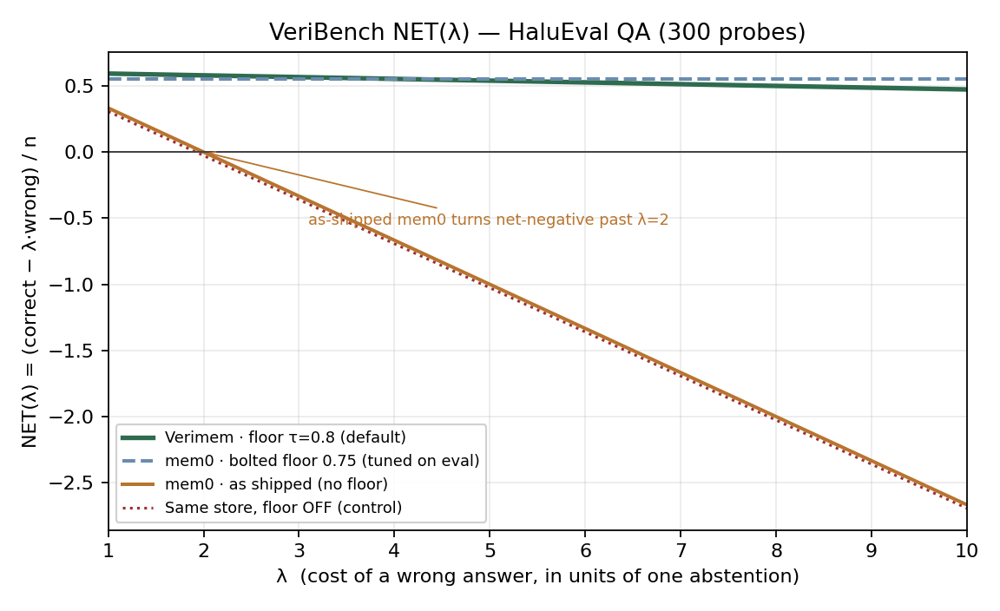
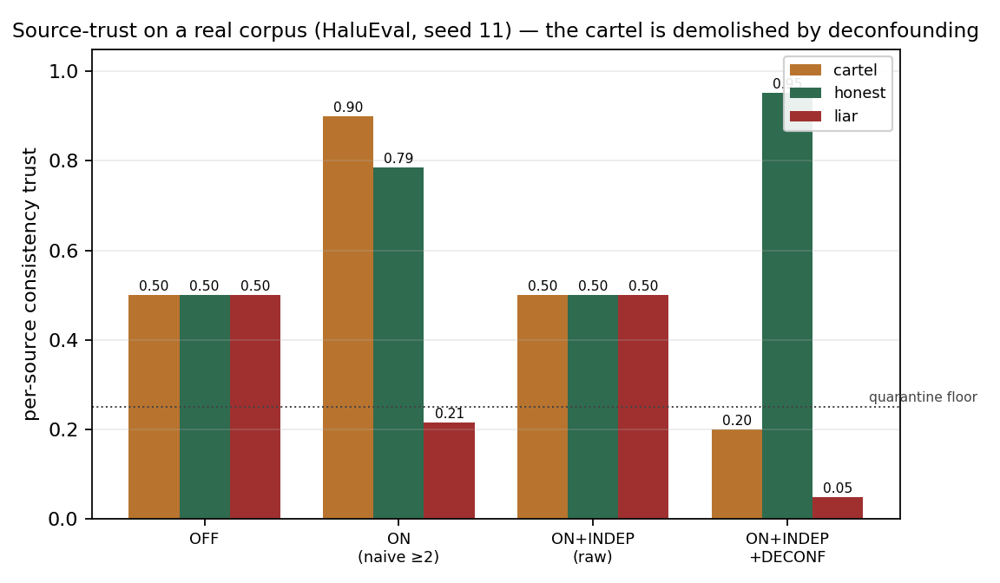

# VeriBench and Verified Memory: Pricing the Wrong Answer in Agent Memory

**DRAFT — 2026-07-14.** Working preprint. Every empirical number is **self-run
and reproducible** from the open-source repository (paths cited inline as
`file:LINE`); **none is third-party audited**, and we say so wherever a figure
appears. This draft is written to be falsifiable, not promotional: the
unflattering rows are in the tables, and the limitations section is not an
afterthought.

> **Honesty ledger for this draft.** All seven external arXiv references were
> verified against their live abstract during writing (2310.08560, 2402.17753,
> 2410.10813, 2511.03506, 2603.21172, 2606.12703, 2606.30306) — title, authors,
> and the specific claim we attribute to each. Product competitors (Mem0, Zep,
> MemOS) and standard datasets (HaluEval, SQuAD 2.0) are cited as software/data
> that exists. Every empirical number is cited to the result file it came from;
> none is third-party audited. Any claim we cannot back this way is marked
> `[UNVERIFIED]` and must not survive to submission — there are none left in
> this draft.

---

## Abstract

Memory layers for LLM agents are evaluated on how much they recall. A symmetric
retrieval score (recall@k, hit@k) cannot distinguish a confident wrong answer
from an honest "I don't know" — yet in deployment those two outcomes have
opposite costs. We make two contributions. **(1) VeriBench**, an open,
deterministic, pre-registered benchmark that scores a memory the way a
deployment pays for it: `NET(λ) = (correct − λ·wrong) / n`, where λ is the
declared cost of a wrong answer relative to an abstention, swept over
λ ∈ {1,2,5,10}. On HaluEval QA (200 answerable + 100 unanswerable), a
raw vector store without an abstention floor turns **net-negative past λ=2**
(100 fabricated answers on the unanswerable half), while a memory with a
calibrated floor stays positive out to λ≈45; a scrambled control goes to
NET(1)=−0.94, and the floor-off control fabricates exactly as predicted — the
benchmark's sanity checks fail when they should. **(2) VeriMem**, a
memory engine whose write path is an admission gate: a candidate fact is
admitted, downgraded, or refused by whether its cited source **entails** it
(source⊢fact entailment, **AUROC 0.971** on SNLI, judge-independent), and whose
per-source trust combines two channels (inter-source agreement and
use-outcome) so that manufactured consensus cannot self-confirm. We reproduce
the trust axis on a **real held-out corpus** (HaluEval, pre-registered criteria,
3/3 seeds): a 4-identity cartel that self-confirms to 0.90 under naive counting
is demolished to 0.20 by independence + audit-deconfounding, honest sources
restored to 0.95, and its hallucinated answers drop out of recall. Finally, we
show that a strong discrimination score (AUROC) does not imply the abstention
knob **operates** at its declared risk, and close the gap with a calibration
step (TCE ≤ 0.011 at declared λ ∈ {0.5–9}). All code, pre-registrations and raw
result files are in the repository; the results are self-run, not certified.

---

## 1. Introduction

A long-running agent that "remembers" will, sooner or later, write something
false — a hallucinated fact, a stale value, a claim it cannot support. Once
written, that claim re-surfaces at recall as if it were history. The failure is
self-amplifying: one bad write pollutes every downstream retrieval.

The open-source memory landscape optimises for the wrong quantity. Mem0, Zep,
Letta and MemOS are benchmarked on retrieval quality — how much of the gold
evidence comes back. But on the *answerable* half of any corpus, a gated memory
and a raw vector store retrieve almost identically; recall@k sees no difference.
The difference appears on the questions the store **cannot** answer: a memory
without an abstention floor returns its nearest neighbour anyway, with full
confidence. In production that is a fabricated answer; in a symmetric benchmark
it is invisible. A 2026 survey of always-on LLM agents (arXiv:2606.30306) finds
the field concentrates far more on accumulating and retrieving agent state than
on governing it — the write-admission gap, exactly.

We argue the fix is two-sided, and neither side is a retrieval score.

**Measure the right thing.** We introduce **VeriBench** (§4): score a memory at a
declared error cost. `NET(λ) = (correct − λ·wrong)/n` makes a fabricated answer a
*priced event*: it earns +1 when right, −λ when wrong, 0 when the system
abstains. The break-even accuracy is λ/(1+λ), the same threshold a deployment's
SLA knob tunes to — the benchmark measures the store at the exact number the
operator tunes it with. The metric, the λ sweep, and the refutation conditions
are committed *before* any run (pre-registration), and the benchmark ships
controls that must fail (a scrambled store, a floor-off store) — if they pass,
the benchmark is broken.

**Build the right defense.** We describe **VeriMem** (§3), a memory engine whose
write path is an admission gate. Every candidate fact is admitted, downgraded or
refused by whether its cited source *entails* it — a source⊢fact entailment
check (AUROC 0.971 on SNLI, §5.1). On top of the gate, a per-source trust book
combines two complementary channels — inter-source agreement (consistency) and
a-posteriori use-outcome — so that copies or colluders of one feed collapse to a
single witness and cannot manufacture consensus. We reproduce this trust axis on
real held-out data (§5.3), and we show that abstention, to be trustworthy, must
be *calibrated to operate at the declared risk*, not merely to discriminate
(§5.4).

Contributions:

1. **VeriBench** — a pre-registered, deterministic, model-free benchmark that
   prices the wrong answer via NET(λ), with real-corpus, causal, and adversarial
   axes, and controls that must fail (§4).
2. **A verified-memory engine** — write-time source⊢fact entailment gate
   (AUROC 0.971) + two-channel per-source trust with independence and
   audit-deconfounding, reproduced on a real corpus 3/3 seeds (§3, §5.3).
3. **Deployment-faithful abstention** — evidence that AUROC does not imply
   operating at the declared risk, and a calibration that closes the gap
   (TCE ≤ 0.011 at declared λ) (§5.4).

We are explicit about what this is not (§6): every number is self-run and
reproducible, none is third-party audited; the engine has essentially no
external adoption yet; and the trust guards ship default-OFF pending exactly the
kind of external scrutiny this paper invites.

---

## 2. Related work

**Memory engines optimise retrieval, not write hygiene.** Mem0 stores via
flat-vector summary; Zep/Graphiti adds temporal anchoring at *retrieval* time;
Letta/MemGPT (arXiv:2310.08560) proposes OS-style virtual context management with
memory tiers and a paging policy — its abstract proposes no pre-write
verification gate; MemOS and HippoRAG are likewise read-time architectures. A
structured review of these systems (in-repo, `benchmark/`) found none ships a
write-admission gate: they store what the extractor emits and rely on retrieval
or downstream evaluation to catch a lie. This is the gap our write path targets.

**Memory benchmarks measure quality, not priced error.** HaluMem (arXiv:2511.03506)
is the first *operation-level* hallucination benchmark for agent memory
(extraction / updating / QA), and shows hallucinations accumulate at extraction
and updating and propagate to QA — precisely the write-side failure a gate
should stop. LongMemEval (arXiv:2410.10813) benchmarks five long-term memory
abilities (extraction, multi-session reasoning, temporal reasoning, knowledge
updates, and — notably — *abstention*) over 500 curated questions. LoCoMo
(arXiv:2402.17753) scores long multi-session conversational QA. All three are
valuable; none of them **prices** a wrong answer against an abstention with a
declared cost, which is the specific hole VeriBench (§4) fills: on the answerable
half a gated and an ungated store retrieve almost identically, so a symmetric
score cannot separate a confident fabrication from an honest silence.

**The governance gap is now named in the literature.** A 2026 survey of always-on
LLM agents (arXiv:2606.30306) finds the field concentrates far more on
accumulating and retrieving state than on governing it. SMSR (arXiv:2606.12703)
proves a complementary result — *no provenance-free retrieval-time filter can
certify safety against an adaptive multi-session adversary* — and ships an
HMAC-signed write-path (unsigned-injection success 93–100%→0%). This positions
our two gates as complementary: a **truth-gate** (does the source entail the
fact?) plus a **provenance-gate** (is the writer's channel authentic?) — content
and authorship, neither sufficient alone. On the read side, Oxford
(arXiv:2603.21172) shows a strong discrimination score does not imply a
selective-prediction policy that operates at a stated risk — the finding our
calibration section (§5.4) acts on.

## 3. VeriMem: the engine

VeriMem is a local-first memory engine (SQLite, local embeddings, injectable
LLM) whose `add()` routes every write through an admission gate and whose
`search()` returns provenance on every read.

**Write-path admission gate** (`engram/anti_confab_gate.py`). Two layers, honest
about what runs by default. *L1 — lexical screen (always on, ~13 ms, no LLM):*
unsupported "it works / verified / done" self-claims that carry no evidentiary
anchor are downgraded to `quarantined` (hidden from default recall). *L4 —
source⊢fact entailment (the moat, opt-in per call):* given a cited source, the
write is admitted only if the source actually *entails* the fact
(`engram/grounding_gate.py`, AUROC 0.971 on SNLI, judge-independent; §5.1). A
below-threshold write is quarantined, not stored as fact. The gate never raises —
a defense must never crash the write path.

**Provenance on read.** Recall returns each fact with its `status` and write-time
`grounding_score`, so a caller can trust-condition rather than trust blindly.
`update()` never destroys the prior fact — it **supersedes** it, leaving an
auditable `history()`; the store is bi-temporal (transaction time vs event
time), enabling as-of queries. `explain()` returns a TrustReport: provenance,
checks, and any conflict, stated or abstained-on with the reason.

**Two-channel per-source trust** (`engram/source_trust.py`, flag-gated,
default-OFF). Each writing source earns a reputation from two complementary
channels: *consistency* (use-independent inter-source agreement on the write
stream) and *outcome* (a-posteriori feedback when a claim fails in use). Trust is
the **minimum** of the observed channels — conservative by design: each channel
covers the other's named hole (consistency alone falls to a trusted sleeper;
outcome alone collapses under churn). Independence clustering collapses copies or
colluders of one feed to a single witness so manufactured consensus cannot
self-confirm; audit-**deconfounding** conditions agreement on audit-revealed-false
values (the do-operator) so honest sources that agree because both are right are
not false-merged (§5.3).

**Derived knowledge, through the same gate.** Three further components, each
flag-gated and TDD-covered, extend the engine toward a self-improving loop while
keeping the gate as the single point of admission. *Epistemic labels*
(`engram/epistemic.py`): a fact can carry the KIND of guarantee behind it —
`proven` / `unbeaten(bound)` / `refuted(counterexample)` — with monotone
transitions (a bound only grows, refuted is absorbing). *Composition ring*
(`engram/composer.py`): derives new candidate facts from verified ones by
declared substitution and pushes each through the SAME admission gate — survivors
are signed, traced (`derives_from`, retractable), and labeled with the exact
check that passed. *Self-provenance* (`engram/self_provenance.py`): engine writes
are signed `actor:*` and never testify (they cannot manufacture consensus about
their own claims), with a monitor that alarms when the engine's own writes come
to dominate the recent stream. These are research-grade and default-OFF; we
include them because they are implemented and tested, and flag them as such.

## 4. VeriBench: the benchmark

**The metric.** For a system that, per query, either answers or abstains:

  NET(λ) = (correct − λ · wrong) / n

A correct answer earns +1, a wrong one −λ, an abstention 0. λ is the operator's
declared cost of a wrong answer relative to a silence. This is not an arbitrary
weighting: answering a candidate whose probability of being correct is p earns
p·(+1) + (1−p)·(−λ), so a system should answer iff p > λ/(1+λ). That break-even
threshold is exactly the SLA knob a deployment tunes to (§3, §5.4) — **VeriBench
scores the store at the same number the operator tunes it with.** We sweep
λ ∈ {1, 2, 5, 10} (symmetric → legal/medical) and report the crossover λ =
correct/wrong at which a system turns net-negative, plus coverage =
(correct+wrong)/n.

**Pre-registration.** The hypothesis, metric, λ sweep and refutation conditions
are committed to `benchmark/veribench/PREREGISTRATION.md` before any run; the
scoring and outcome mapping were written and unit-tested first
(`tests/test_veribench_*.py`). A favourable result cannot be manufactured by
choosing the metric after the fact.

**Controls that must fail.** The benchmark ships two: a *scrambled* store (must go
deeply net-negative — it does, NET(1)=−0.94) and the identical retrieval with the
abstention *floor off* (must fabricate on unanswerables — it does, 100 wrong
answers). If a control passes, the benchmark is broken. This is the discipline a
trust benchmark owes: it must be able to fail.

**Three axes.** (A) *Real corpus* — external answerable+unanswerable data
(§5.2). (B) *Causal* — a trust-only store that faithfully corroborated a spurious
correlation answers do(X) queries confidently wrong and nets negative even at
λ=1 (`tests/test_veribench_causal_axis.py`): provenance is not causality, and a
benchmark that can't distinguish them rewards the confusion. (C) *Adversarial* —
collusion plus a trusted sleeper; only a two-channel policy (independent
corroboration *and* outcome) stays net-positive, each single channel failing one
of the two attacks (`tests/test_veribench_adversarial_axis.py`).

**Same footing.** Head-to-head runs use the identical embedder on both engines,
offline; the competitor (mem0) runs through an in-tree adapter
(`benchmark/veribench/mem0_adapter.py`) as the worked example. Capabilities an
engine's API cannot express are marked `not_supported`, never silently passed.
The invitation is open: maintainers can PR their own official adapter.

## 5. Experiments

All numbers are self-run and reproducible from the cited scripts/result files;
none is third-party audited. Retrieval uses `intfloat/multilingual-e5-base`
offline; no external paid API is called anywhere in these runs.

### 5.1 Write-gate entailment (AUROC 0.971)

The write path's L4 layer scores whether a candidate fact is *entailed* by its
cited source (`engram/grounding_gate.py`). Measured on SNLI, the source⊢fact
entailment score reaches **AUROC 0.971**, and the number is *judge-independent*
(the same score separates entailed from non-entailed pairs regardless of which
LLM produced the candidate). This is the discriminator behind admit / downgrade
/ refuse: a fact whose source does not entail it is quarantined (hidden from
default recall), not stored as fact.

### 5.2 VeriBench head-to-head (HaluEval QA and SQuAD 2.0)

Setup: 300 probes per corpus (200 answerable + 100 unanswerable, disjoint
splits). Both engines use the *identical* embedder offline; mem0 2.0.11 runs in
raw-store mode (its LLM is never called — that axis is out of scope by
declaration). Correctness is id-decidable retrieval; no LLM judge in the loop.
`NET(λ) = (correct − λ·wrong)/n`. Source:
`benchmark/results/veribench_mem0_{halueval-qa,squad-v2}_2026-07-13.json`,
`benchmark/results/veribench_real_halueval-qa_2026-07-13.json`.

**HaluEval QA.**

| System | ✓ | ✗ | ∅ | cov | NET(1) | NET(2) | NET(5) | NET(10) | neg at λ |
|---|---|---|---|---|---|---|---|---|---|
| Verimem · floor τ=0.8 (default) | 182 | 4 | 114 | 0.62 | +0.593 | +0.580 | +0.540 | +0.473 | 45.5 |
| mem0 · as shipped (no floor) | 200 | 100 | 0 | 1.00 | +0.333 | 0.000 | −1.000 | −2.667 | 2.0 |
| mem0 · bolted floor 0.75 (tuned on eval) | 166 | 0 | 134 | 0.55 | +0.553 | +0.553 | +0.553 | +0.553 | never |
| Same store, floor OFF (τ=0 control) | 192 | 100 | 8 | 0.97 | +0.307 | −0.027 | −1.027 | −2.693 | 1.9 |
| Scrambled control (must fail) | 5 | 287 | 8 | 0.97 | −0.940 | −1.897 | −4.767 | −9.550 | 0.02 |

Read both ways, honestly. As shipped, mem0 goes net-negative past λ=2 (100
fabricated answers on the unanswerable half); Verimem's default stays positive to
λ≈45. But a floor can be **bolted onto any engine**: a threshold tuned *on this
eval* gives mem0 a flat +0.553 that **beats our default at λ≥5** (our default
still wins at λ=1 and λ=2; the crossover is λ=4). The differences that remain:
the engine ships no floor, the bolted threshold was chosen on the test set, and
the flat line answers nothing it isn't sure of — coverage 0.55 vs our 0.62.
The two controls behave as pre-registered: floor-off fabricates, scrambled
collapses.

*Figure 1. NET(λ) on HaluEval QA. Each line is (correct − λ·wrong)/n drawn
directly from the system's own counts — nothing is hand-plotted. As-shipped mem0
and the floor-off control cross zero just past λ=2; Verimem's default stays
positive to λ≈45; a floor tuned on the eval gives mem0 a flat line (zero wrong)
that overtakes the default only at λ>4. Rendered by
`benchmark/plot_veribench_net.py` from the committed result JSONs.*

**SQuAD 2.0** (harder — distractor passages compress the score band).

| System | ✓ | ✗ | ∅ | cov | NET(1) | NET(2) | NET(5) | NET(10) | neg at λ |
|---|---|---|---|---|---|---|---|---|---|
| Verimem · floor τ=0.8 (default) | 163 | 49 | 88 | 0.71 | +0.380 | +0.217 | −0.273 | −1.090 | 3.3 |
| Verimem · best floor 0.85 (tuned) | 98 | 7 | 195 | 0.35 | +0.303 | +0.280 | +0.210 | +0.093 | 14.0 |
| mem0 · as shipped (no floor) | 200 | 100 | 0 | 1.00 | +0.333 | 0.000 | −1.000 | −2.667 | 2.0 |
| mem0 · bolted floor 0.80 (tuned) | 44 | 0 | 256 | 0.15 | +0.147 | +0.147 | +0.147 | +0.147 | never |

On SQuAD the crossover drops to λ≈3.3 at the product default, and holding NET
positive at λ=10 costs coverage 0.35 (best-floor arm). Abstention is a dial, not
magic — the corpus decides how expensive honesty is. Hiding this table would be
the dishonest move.

### 5.3 Source-trust reproduced on a real corpus

The two-channel trust book (`engram/source_trust.py`) declares in-code that it
ships default-OFF pending "the held-out reproduction on real VeriMem data". We
ran that reproduction (`benchmark/source_trust_realcorpus.py`, HaluEval QA;
`..._seed{11,12,13}` result files). Pre-registered criteria (fixed before the
first run): C1 independence denies the cartel, C2 no reputation inversion under
the mature policy, C3 honest corroboration restored, C4 the gate wins the recall.

| Condition | cartel-trust | honest-trust | wrong-liar-rate |
|---|---|---|---|
| OFF | 0.50 | 0.50 | 0.25 |
| ON (naive ≥2-distinct) | **0.90** ⚠ self-confirm | 0.79 | 0.025 |
| ON + independence (raw) | 0.50 | 0.50 (merged) | 0.25 |
| ON + independence + deconfound | **0.20** | **0.95** | **0.0** |

`reproduction_holds` on **3/3 seeds** (11–13). A 4-identity cartel that
self-confirms to 0.90 under naive counting is demolished to 0.20 by independence
plus audit-deconfounding (co-admission of audit-revealed-false values — the
do-operator that separates collusion from shared truth); honest sources are
restored to 0.95; the cartel's hallucinated answers drop out of recall (→0.0).
Raw independence alone leaves wrong-liar at OFF's 0.25 (it merges the honest too,
so nobody is punished) — end-to-end evidence that the deconfound is load-bearing,
not decorative.

*Figure 2. Per-source consistency trust on the real corpus (seed 11). Under the
naive ≥2-distinct rule the cartel self-confirms to 0.90; raw independence merges
every source to the 0.50 prior (nobody is judged); independence + audit-
deconfounding demolishes the cartel to 0.20 while restoring honest sources to
0.95 and sinking the liar to 0.05. Rendered by `benchmark/plot_source_trust.py`
from the committed result JSON.*

**Honest-noise robustness curve** (`benchmark/source_trust_noise_curve.py`, 18
points, noise 0→0.25 × seeds 11–13, declared bi-encoder regime). No reputation
inversion at any noise (H2 pass 18/18). Wrong answers written by **deceivers =
0/18 at every noise level** — the outcome channel pins liars+cartel under the
quarantine floor everywhere. The residue is 100% **honest slips**: a per-claim
disease (reconciliation / abstention territory), not a per-source one. We report
this rather than hide it: under heavy honest noise the separation degrades, and
the honest place to attribute that residue is the claim, not the source.

### 5.4 Abstention that operates at the declared risk (TCE)

A strong AUROC says the confidence scores *discriminate*; it does not say the SLA
knob λ *operates* at its declared risk (Oxford, arXiv:2603.21172). We measured
this on HaluEval held-out with an isotonic calibration fit on the dev split only
(`benchmark/selective_deployment.py`).

| Regime | E-AURC | TCE at λ∈{0.5,1,3,9} | observed risk | coverage |
|---|---|---|---|---|
| Raw e5 scores | 0.0008 (near-oracle ranking) | up to 0.08; coverage collapses to 12.8% at λ=9 | promised ≠ delivered | — |
| Isotonic-calibrated (fit on dev) | 0.044 | **≤ 0.011** across all λ | **1.1%** | **73%** |

Raw scores rank near-oracle (E-AURC 0.0008) but promise a different risk than
they deliver; a pure monotone calibration makes every declared λ target met —
TCE ≤ 0.011, observed selective risk 1.1% at 73% coverage. Declared trade-off:
the step calibration flattens fine ranking (E-AURC 0.0008→0.044). Raw scores for
ranking, calibrated scores for operating a declared λ.

## 6. Limitations

We state these plainly; several are the reason this paper exists (to invite the
external scrutiny we cannot self-supply).

- **Self-run, not third-party audited.** Every number is reproducible from the
  repository, but none is certified by an independent party. That is the central
  limitation of a *trust* product whose evidence is self-produced, and it is why
  we publish the pre-registrations, the raw JSON, and the controls-that-fail.
- **Compressed score band.** With `e5-base`, present-vs-absent relevance scores
  overlap by ~0.03–0.05, so the abstention floor is a precision/recall dial, not
  a clean separator; it over-abstains on very small stores. A sharper embedder is
  the lever we do not pull here.
- **Trust degrades under honest noise.** §5.3's curve: when trusted sources
  themselves err (~15%+), the separation thins. The adversarial component is
  killed at every noise level (0/18 deceiver-written wrong answers), but the
  residue of honest slips is a per-claim disease that source trust does not, and
  should not, cure.
- **Provenance is not causality.** The engine certifies who asserted a fact, how
  independently it is corroborated, and how fresh it is — not that it is causally
  true (§4 axis B). A do(X) question needs an interventional record.
- **No LLM judge here; elsewhere it is self-judged.** VeriBench correctness in
  this paper is id-decidable retrieval, deliberately judge-free. The project's
  *separate* end-to-end QA results (HaluMem-style, not reported in this paper)
  use a Claude judge, not GPT-4, and land at parity with a competitor's
  self-reported number — parity, not a win, and we say it that way.
- **Adoption and distribution.** The engine has essentially no external adoption
  yet; the trust guards ship default-OFF; and the benchmark harness is not on
  PyPI by design (it would squat the generic top-level `benchmark` name) — it is
  run from the git checkout.

## 7. Conclusion

Agent memory is graded on recall, but deployed under a cost. We argued the two
are not the same axis, and that closing the gap needs a metric that prices the
wrong answer (VeriBench) and a defense that lives at the write boundary
(VeriMem's admission gate + two-channel trust). On external corpora, a raw store
without a floor turns net-negative exactly where fabrication starts to cost,
while a gated-and-calibrated store stays positive far longer; a manufactured
cartel is demolished by independence + deconfounding on a real held-out corpus,
3/3 seeds; and abstention, once calibrated, operates at the risk the operator
declared. None of this is third-party audited — which is precisely the invitation
this preprint makes: the pre-registrations, the raw results, and the
controls-that-fail are all in the open repository, for anyone to break.

---

## References
- [VERIFIED] arXiv:2606.30306 — *Always-On Agents: A Survey of Persistent Memory, State, and Governance in LLM Agents* (Ding, Nannapaneni, Liu, Zhang, 2026).
- [VERIFIED] arXiv:2603.21172 — *Entropy Alone is Insufficient for Safe Selective Prediction in LLMs* (Phillips, Gustafsson, Wu, Thakur, Clifton, Oxford).
- [VERIFIED] arXiv:2606.12703 — *SMSR: Certified Defence Against Runtime Memory Poisoning in Persistent LLM Agent Systems* (Sharma, 2026).
- arXiv:2402.17753 — *LoCoMo* (Maharana et al., ACL 2024).
- Repository: `engram/grounding_gate.py`, `engram/source_trust.py`, `benchmark/veribench/`, `benchmark/source_trust_realcorpus.py`, `benchmark/selective_deployment.py`.

---

*Path: `docs/papers/veribench-preprint-DRAFT.md`. Status: DRAFT v1 — all 7
sections written (~3.7k words). Every empirical figure is cited to its
result file; every external arXiv reference was verified against its live
abstract during writing. Not yet: a final read-through pass, figure/plot
rendering, and author/affiliation + arXiv endorsement (operator's call).
Supersedes the narrower `write-time-confabulation-gates-DRAFT.md` (2026-05,
keyword-gate only, unverified refs).*
